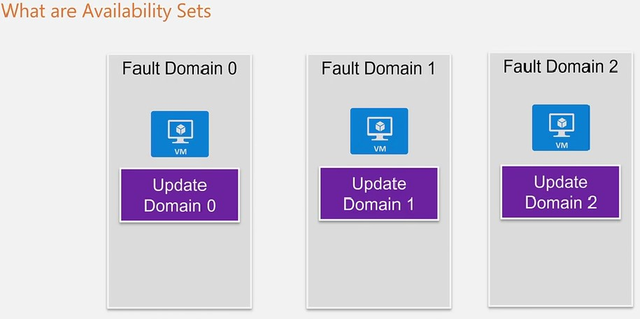
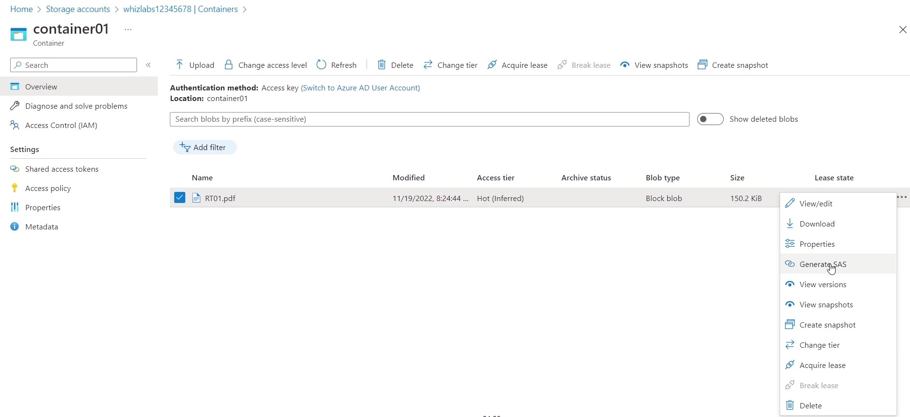

# AZ-900 Fundamentals

Azure certifications are divided into three levels funcamental, associate and expert. AZ-900 is the first certification that unlocks all other levels of azure certificates.

## Overview

The AZ-900 Micorsoft Azure Fundamentals exam is a foundation-level certification, which indicates you don't require a complete understanding of Cloud computing or Azure.

Person VUE is the offical testing company for Azure certifications.

### Exam Objectives

- Decribe cloud concepts.
- Describe Azure architecture and services.
- Describe Azure management and governance.

### Exam Details

Number of Questions: 40-60 Questions

Exam Duration: 60 minutes

Exam Passing Score: 700 (70%)

Exam Cost: 99$

### Cloud computing

Allows businesses to:

- Access computing resources on demand.
- Scale their computing resources up or down as needed.
- Access to a wide range of applications and services.
- Increased security and reliability.

## Cloud Concepts

### Introduction

#### Cloud computing

- Ability to harness the power of computing on the Internet.
- It's over the Internect - Easy available.
- Allows you to use a variety of resources - Little or no initial investment.
- Flexible: Use whenever you want

#### More Advantage

- Cloud Platform like Azure makes things simpler.
- You have the ability to create a virtual server on the Internet.
- You don't need to manage aspects such as the pysical server, networking, cooling, physical security.
- You don't need to make an inital investment.
- You only pay for what you use.

#### Infrastructure Features

- Ability to discribute resources across regions.
- Add high availability to your architecture by using such as the Azure Loader Balancer, Traffic Manager.
- Add scalability to your architecture by using services such as Virtual Machine scale sets.
- Add Disaster Recobvery by using Backup the Recovery Service.

### Different Cloud Models

#### Public Cloud

- Examples are Cloud service providers such as Microsoft Azure.
- Physical infrastructure is managed by Microsoft.
- You have access to various services offered by the cloud provider.
- You can access the various services by using a simple web browser.
- Lower costs, less maintenance.
- High availability and reliability.

#### Private Cloud

- Here the physical infrastructure is managed by your company.
- This is the when the company wants to own the entire infrastructure.
- Government agency or a financial institution - They want to own the infrastructure and the data.
- But you would need to invest in the frastructure.

#### Hybird Cloud

Example:

You have resources hosted in Azure, and you have your resources hosted on your on-premise servers. You can have a connectivity between Azure and your on-premise data center.This is a Hybird Cloud Model, where in your applications can reside either in Azure or in on-premise or a combination of both.

- Here you connect Azure to your on-premise infrastructure.
- Get the best from both sides. You can use the services offered from Azure, and if you want to have more control over your infrastructure, you could host applicaitons on your on-premise side.
- If you can't migrate your current workloads to the cloud.
- There are additional cost and maintenance, because you are managing applications on both sides, both in Azure and your on-premise environment.

### Different Service types

#### Infrastructure as a service - laas

Example:

Now in Azure, if you want to create a virtual server, you would create a virtual machine. You could use the Azure portal to create a virtual machine. When you create a virtual machine that machine in turn will be stored on a physical server hosted in an Azure data center.

- Here the physical server is managed by Azure.
- You don't need to manage the various aspects of the physical server.
- You only manage the virtual server.
- Allows you to quickly provision environments and also terminate environments whenever they are not required.

##### Advantage

- No Capital Expenditure.
- Reduces the operating expense.
- You can focus on whats' important - your business.
- You can get access to various computing types.
  - When you create a virtual machine, you have different sizes of virtual machine. You can decide a size which has more cpu, for more cpus based on workloads.

- You can host various types of workloads on the virtual machines.

#### Platform as a service - Paas

Example:

You have a virtual machine. The virtual machine is hosted on a physical server, and then you have additional systems, which comes part of this pacage.

- Platform has a service. Here the physical server is managed by Azure.
- Here even the virtual machines are managed by Azure.
- Event some systems are automatically setup for you.
- Example - Datebase management system that's available on the Azure playform.

##### Advantage

A completed package that's given to you on the Azure playform.

- Example of the Azure SQL Database.
- Allows you to host a database in Azure.
- Here the database management system is managed on Azure.
- Gives features such as automatic high availability.

#### Software as a service -SaaS

Example:

You have a virtual machine, the addtional systems, and now you even have a software that's provided has part of the complete package.

- Here in addtion of the platform as a service, the software is installed and maged for you.
- Example - Email providers such as Gmail.
- Office 365 - Online versions of Word, Powerpoint.

### Shared Responsibility Model

Reponsibilities between the Customer and Azure.

When you have resources deployed to an on-premise data center, you are responsible for the entire setup:

- The Infrastructure - The servers, storage, maintenance and security of the data center.
- Securing your applicaitons.
- Securing data at rest and in transit.

When you start moving to the cloud, when it comes to Azure, Azure takes a set of responsibilities:

- Its important to understand the line of responsibilities.
- It helps you plan on what tasks you need to curry out when you have resources deployed to Azure.


Example

When you create an Azure virtual machine:

- Azure is responsible for the uptime of the service.
- Azure is responsible for the uptime and maintenance of the underlying physical infrasturcture.
- Azure is responsible for the various aspects in the data center - Cooling, security.
- Customer is responsible for operating system level patching.
- Customer is responsible for the applications and data hosted on the virtual machine.

## Azure Core Services - Part 1

### Azure Subscriptions and Resource Groups

#### Azure Subscriptions

- A subscription is a logical container utilized by Azure to provision cloud services. If the limit for a single subscription are reached, businesses may create additional subscriptions.
- Each subscription service has its own restrictions, therefore many subscriptions can be required if a very high scale is required.
- Having multiple payment options is the second justification for having several subscriptions.
- Addtionally, you can separate resources into distinct departments or projects inside different subscriptions.
- They assist you in setting up how Azure resources are accessed and how comsuption of those resources is recorded, billed, and paid for.

#### Resource Groups

- A resource group serves as a container for organizing related resources within an Azure solution. It allows you to manage all the necessary resources as a cohesive unit.
- They are a crucial component of Azure that enables the grouping of comparable services to offer a comprehensive solution.
- Resources with the same resource lifetime are frequently grouped together using resource groups.
- A single resource group can be used to distribute resources across various Azure regions.
- In an Azure solution, a resource group is a holding area for related resources.
- You have the option of include all of theresources used by the solution in the resources group or just the ones you want to control jointly.
- Depending on what is best for your organization, you choose how to distribute resources to resource groups.
- For ease of deployment, updating, and deleting as a group, add resources with the same lifetime to the same resource group.
- Information about the resources is stored in the resource group. As a result, you are specifying the location of the metadata when you give a location for the resource group.
- You might need to make sure that your data is stored in a specific area for compliance reasons.

### Regions

- Azure have regions across the world which can be used to host resources.
- These are differnt geographic locations situated across the world.
- You can host resources in Azure in any one of available regions.

### Availability Zones

- This is a feature that offers high availability for your resources by protecting them from data center failures. For example, distributing the virtual machines across the various availability zones within a particular region, it can protect the resources from a data center failure.

- Theses are physically separate locations within an Azure region.
- Each Availability Zone is made up of one or more datacenters equipped with independent power cooling, and networking.
- Each Availability Zone is equipped with independant power, cooling, and network.
- Use Availability Zones to rum mission-critical applications with high availability and low-lathency replication.
- To ensure the best resiliency, there is a minumum of three separate zones in all enabled regions.
- When creating three or more virtual machines across the three availability zones, the virtual machines are automatically spread across the Fault and Update Domains.
- When create two or more virtual machines across two or more availability zones in the same region, Azure guarantees virtual machine connectivity to at least one instance at least **99.99%** of the time.

#### Example


In a particular region, there are three availability zones, so each zone has its own independent power, cooling and networking. When launching virtual machines as part of the application infrastructure, these virtual machines can be distributed across the various availability zones. There is interconnectivity between these availability zones. If one availability zone were to go down, there are still others available.


### Data Center

- When you crate resources in Azure, they are created in the underlying data center.
- Azure is responsible for maintaining the data center.
- The data center contains all the physical infrastucture required to host resources in Azure.

### Availability Sets

Now you spin up a couple of virtual machines in Azure,. These two virtual machinese are basically launched on an underlying physical server in an Azure data center. You don't have control over the actualy physical server that's hosting the virtual machines. The both of your virtual machines which is hosting your application launched on the same physical server. This physical server has common components are networking, power and cooling. If the underlying pyhsical server has a problem and that would impact both of the virtual machines in Azure. In order to increase the availability of your virtual machines in Azure, one option is to make use of availability sets.

When you host your virtual machines in Azure, you need to be weary of the following:

- **Unplanned Hardware Maintenance Events** - This is when the underlying palyform detects a failure and needs to carry out an unplanned hardware maintenance event to reduce the impact to virtual machines.

Azure will try to ensure that event thought there is an event happening on the underlying pysical machine. It will try to reduce the impact on the virtual machines on the pysical server. In this case, Azure will use a concept or a feature known as **Live Migration** to move virtual machines to a pysical machine wich works to ensure there is no impat on your virtual machine, but there are cases wherein Live Migrate won't work, such event you might experience a downtime for your virtual machines.

- **Unexpected downtime** - This happens when the underlying physical hardware hosting the virtual machine fails. This could included local network failure, local disk failures, or other rack level failures. Azure will migrate the virtual machine to a healthy physical host, but you will experience a downtime for the underlying virtual machines.
- **Planned Maintenance Events** - These are periodic updates made by Microsoft on the underlying Azure playtform. This is required events to improve the reliability, performance and security of the underlying infrastructure. These events can cause a reboot of virtual machines.

#### Concept

If you have two or more Virtual Machines deployed in the same Availability Set, that you will have a guarantee of Virtual Machine connectivity to at lease one instance **99.95%** of the time. These two or more virtual machines get deployed across different physical racks, which are connected onto separate power supplies, cooling, networking. Even one does fail, you will still have a virtual machine up and running.

- Availability sets can be used to improve the service level agreement of your underlying virtual machines.
- Each virtual machine should use Premium or Ultra Disks for all operating systems and data disks in order to ensure the connectivity.

#### **Fault doman** and **Update** domain

When you deploy your virtual machines to an availability set, they are allocated a fault and update domain.

**Fault Domains** - These define a group of virtual machines that share a common power source and network switch.

- This can help protect your virtual machines against potential hardware failures, network outages or power interruptions.
- There are a maximum of 3 fault domains per region.

**Update Domains** - These define a group of virtual machines that can be rebooted at the same time.

- These can help against updates issued against the underlying physical infrastucture.
- There are a maximum of 20 update domains per region.

#### Example



There are three Fault Domains, that's part of an availability set. When you start deploying your virtual machines to an availability set, these virtual machines will be spread across the different Fault Domains. Fault domains are basically used to help protect against any physical problems in the infrastructure. Each fall domain will be connected to a separate networking sector, a separate power sector, so if any of those elements fail in any Fault Domain, you would still have the other virtual machines up and running.

Besides there is a Update Domain in each Fault Domain, this helps against regular updates to the underlying infrastructure. In this case, Microsoft needs to perform the update to its underlying physical infrastructure. The thing is it will first apply the update onto the Update Domain 0. That is logical groupping, so it will first update whatever is the physical infrastructure that's linked to Update Domain 0. During that time, the virtual machine in this Update Domain might be rebooted, but this still means that other virtual machines in other Fault Domains will be up and running. Once the update is complete on Update Domain 0, then the update will then start on Update Domain 1. At any point in time, there are always two virtual machines running across the availability set.


- Two virtual machines (whizlabset1, whizlabset2) running in an availability set with Fault Domains and Update Domains.

#### Important


When adding a virtual machine to the availability set, this has to be done at the time of creation of the virtual machine. If there is an existing running virtual machine that's not part of an availability set, can not add that virtual machine onto an existing or a new availability set. Adding a virtual machine to an availability set can **only** be done during the watch machine creation time.

Availability zones are similar in concept to availability sets. However, there is a distinct difference. While availability sets are used to protect applications from hardware failures within an Azure data center, availability zones, protect applications from complete Azure data center failures.

### Virtual Network

Azure Virtual Networks are a key component of the Azure networking stack that allows to create isolated and secure network environments in the cloud.

#### Creating

- Using the Azure SDK or Azure CLI.
- Specify its address space and ubnets.
- Define network security groups and route tables to control the fraffic flow within the network.

#### Connectivity Options

- Connect your Virtual Network to your on-premises network.
- Connect multiple Virtual Networks together using Azure Virtual Network Peering, which allows traffic to flow between them as if they were on the same network.

#### Security and Compliance

- Using Network Security Groups control access to Virtual Network resources, which allow to define inbound and oubound traffic rules based on source and destination IP addresses, ports and protocols.
- Use Azure Firewall to create a centralized cloud-based firewall service for the Virtual Networks.
- Virtual Network is compliant with a number of industry standards including IS027001, HIPPA and PCIDSS.

#### Scalling and High Avalability

- Deploy Virtual Network across multiple Azure regions for redundancy and disaster recovery.
- Use Azure Load Balancer to distribute traffice across Virtual machines and make them highly available.

### Virtual Machine

The Virtual Machine gets deployed to a Virtual Network which is an isloated section on Azure used to host Virtual Machines. When creating the virtual machine in the Azure, it allows you the option to create a Virtual Network. When creating the virtual machine, it gets assigned a Network Interface. The Network Interface gets assigned a private IP address that is used for internal communication between Virtual Machines in a Virtual Network. The Network interface gets allocated a public IP address that allows the communication with the virtual machine over the Internet. 

- The Virtual Machine can have multiple Disks.
- Thses are VHD files.
- By default there is an OS disk assigned to the machine.
- Can assign Data disks to the machine.
- Contrl the traffic flow using Network Security Groups.
- Monitor the different uderlying metrics - CPU utilization, Network utilization.

#### Important

- The Virtual Machine name is and important Azure resoure that is not easy to change once set. Is better for name is meaningful such as devusc-webvm01(dev:purpose+usc:location+web:server type+01).
- The network addresses and sbnets can be difficult to modify once they've been set up.
- The Virtual Machine's location can limit available options sice different regions have different hardware configurations available.
- The Virtual Machine's location can cause price difference.

#### Payment

- The Virtual Machines are billed for two separate costs: compute and storage.
- Compute costs are charged on a per-minute basis for every hour of usage.
- When the virtual machine is stopped and deallocated, it not charged for computing capacity.
- The cost of the operating system license is bundled into the price.

Two payment options for computing costs:

- **Consuption-based** pricing is pay-as-you-go, and it charged for computing capacity by second. It is suitable for applications with short-term or unpredictable workloads that can't be intterupted.
- **Reserved Virtual Machine Instances** (RI) is an advance purchase of a virtual machine for one or three years ina specified region. RIs provide up to 72% price savings compared to pay-as-you-go pricing and are flexible to exchange or return when an early termination fee. It is ideal for virtual machines that need to run continuously, requiring buget predictability, and can commit to use the virtual machine for at least year.

#### Virtual Machine Sizing


### Network Security Groups

The Network Security Group will be attached to the network interface. The Network Security Group can be assigned either to the virtual network interface or to the subnet itself that will affects all the virtual machines that are hosted in that subnet.

- Used to control traffic into subnet or Virtual Machine.
- Consists of rules for Inbound and Outbound traffic.

#### Rules

- Each rules has a source and destination, which can be either an IP address, a CIDR block, service tag or application security group.
- Define the port numbers for the rule.
- Define the protocol.
- Decide whether to allows or deny the action.

#### Example

If want to allow inbound connectivity from Internet onto the public IP address of virtual machine, then need create a network security group rule to allow inbound connectivity on Port 3389.


If want to enable webserver of virtual machine, create a network security group rule to allow inbound on Port 80.

### Virtual Machine Scale Sets

There is web application that's hosted on a virtual machine. The users who are accessing this web application on the virtual machine. The number of users start to increase and make the virtual machine can't handle the load anymore, like getting a high amount cpu utilization, which case slow response times for the web application. 

**Solutions:**

1. You could increase the instance size, which could result in a downtime for the web application. Need to stop virtual machine and resize the virtual machine, and then start it again.
2. Manual add new virtual machine.
3. Use Scale Set

**Use Scale Set:** 

Deploy the application on a host of virtual machines that's controlled by the scale sets service. In the scale set, there is one virtual machine running for the application. If the amount of users increased, the scale set feature will start increasing the virtual machines based on certain thresholds that you defined. If the amount of users goes back down, the scale set feature will detect if the CPU utilization goes below 30%, and that then remove virtual machines from the scale set.

#### Feature

- Allows to scale the infrastructure based on demand by creating a set of identical virtual machines.
- Infrastructure can scale in and out.
- Can be applied to Azure Web Apps as well.
- Can place the machines in the scale set behind either a Load Balancer or an Application Gateway.

### Load Balancer


There a set of virtual machines that are hosting the application. The requirement is to ensure a good distribution of request between the virtual machines. Don't want all the requests just to go one virtual machine, and want to ensure an equal distribution of requests onto the backend virtual machines, which can be achieved by a service using Azure Load Balancer. Instead of the requests from users going directly to the backend virtual machines, the requests go to the Load Balancer, the Load Balancer would then have the responsibility of direccting those request onto backend virtual machines. The Load Balancer would ensure an equal distribution of the requests from the users.


There are to tiers of a web appplication Web Server and Database Server. In order to distribute the traffice onto web servers, a public load balancer can be created. The users would be directing their requests onto the public load balancer and would go to backend virtual machines. At same time, distributing the requests from web servers to the database servers, the internal load balancer can be created, so that the requests from the web server virtual machines would be equally distributed onto the Database servers. 

#### Feature

- Can create an **Internal Load Balancer** - Only balance traffic from within a Virtual Network.

- Can create **Public Load Balancer** - Can be used to load balance internect traffic to Virtual Machines.

- There are also 2 pricing tiers for Load Balancers -**Basic** and **Standard**.

- Provides high availability for applications.

- The Load Balancer itself is a fully managed service inAzure.

- Allows to distribute traffic to backend virtual machines.

- For the **Basic** Load Balancer - Can define a virtual machine, an availability set or a scale set as a Backend pool.

- For the **Standard** Load Balancer - Can define many backend virtual machines.

- **Heath Probe** - Used to check whether a backend virtual machine is healthy or not.

  In order ensure that the load balancer directs requests onto a proper functioning backend virtual machine, the load balancer needs someway whether the virtual machine is healthy or not, which can be doen with the help of a Health Probe. In the Load balancer, Health probe can be defined. In the Health Probe, can define what aspects the Health Probe will check:

  - Protocol
  - Port Number
  - Interval for the Health Probe to check virtual machine

- **Load Balancing Rules** - Define how to route traffic when it arrives on the Load balancer. Can use the rules to redirect traffic to the backend pool.

- **Session Persistence** - Client IP can be directed to the same backend virtual machines.

After creating a load balancer, need to create a backend pool.

### Application Gateway


- Instead of having the default routing of traffic in the Load Balancer, if want to have URL based routing, then Application Gateway service can be used.
- Based on the URL, the Application Gateway will direct to the specific virtual machine's application.

#### Feature

- Has Web Application Firewall to protect web applications that site behind the Application Gateway. Protect against common attacks.

### Storage Accounts

It is a cloud service that provides secure storage for applications and services. It is used for storing and accessing large amounts of data for various applications and services. Storage accounts provide redundancy scalability and performance for storing data in the cloud.

#### Feature

- Durable and highly available
- Secure
- Scalable
- Managed
- Accessible

### Storage Services

It offers a wide range of storage options for applications and services. It can store a variety of data types, including blobs, files, queues, and tables.

Types of Data that could be stored in Storage Accounts

- Blobs: unstructure data that can be stored in any format such as text images,  audio, video and binary data. Blobs can be accessd via a URL.
- Files: files are stored in file shares which are similar to file systems on a local computer.
- Queues: store messages that can be processed asynchronously. It is ideal for storing tasks that need to be processed in the backgraound such as sending emails or processing images.
- Tables: store structured data in no SQL database. It is ideal for storing large amounts od data that need to be accessed quickly.
- Disk: store virtual machine imags.
- Archives: store large amounts of data that is rarely accessed.

#### Azure Elastic SAN

It is a cloud-based storage solution that provides organizations with the ability to store and manage large amounds of data in the cloud. It is a fully managed storage solution that is designed to provide organizations with the scalebility, reliability and performance. 

### Storage Tiers

Storeage Tiering System is a hierarchical storage system that allows users to divided their data into different storage tiers, such as hot, cool, and archive tiers, based on their cost and access requirements.

#### Available Tiers

- Hot Tier: high performance and low latency for frequently accessed data.
  - web applications
  - media streaming
  - gaming
  - virtual machine.
- Cool Tier: data access less frequently. It's ideal for applications that require infrequent access to data.
  - backups
  - media
  - archives

- Archive Tier: data access rarely.
  - rarely accessed data
  - long-term storage of data

### Storage Redundancy Options

Redundancy options are a set of features that help protect data and applications from outages, data loss, and disruptions.

#### Geo redundancy

- replicates data across multiple Azure regions 

- allowing for data to be recovered in the event of an outage in one region 

#### Zone redundancy

- replicates data across multiple Azure zones

- allowing for data to be recovered in the event of an outage in one zone

#### Available Redundancy options

##### Redundancy in the primary region


###### Locally redundant storage (LRS)

Replicates the storage account three times within a single data center in the primary region. 

It is the lowest cost redundancy option.


###### Zone-redundant storage (ZRS)

Replicates the storage account synchronously across three availability zones in the primary region.

##### Redundancy in a secondary region


###### Geo-redundant storage (GRS)

Replicates the storage account synchronously three times which in a single physical location in the primary region using LRS, and then copies data asynchronously to a single physical location in a seconday region that is hundreds of miles away from the primary region.


###### Geo-zone-redundant storage (GZRS)

Replicates the storage account across three availability zones in the primary region, and also replicated to a secondary region.

###### Read-access geo-zone-redundant storage (RA-GZRS)

###### Read-access geo-redundant storage (RA-GRS)

With a storage account configured for GRS or GZRS, data in the secondary region is not directly accessible to users or applications unless a failover occurs. The failover process updates the DNS entry provided by Azure storage so that the secondary endpoint becomes the new primary endpoint for the storage account. During the failover process, the data is inaccessible. After the failover is complete, you can read and write data to the new primary region. If your applications require High avaiability, then can configure the storage account for read access to the secondary region. After that data is always available to be read from the secondary region.

### File Movement Options

#### AzCopy

It is a command-line utility that can use to copy blobs or files to from a storage account.

1. Need to Generate SAS URL from original source and target Container to prepare data to be copied.

   Original Source:




​		Target Container:


2. Command - Azure Cloud shell

   ```
   # azcopy copy <Source> <Destination>
   ```

   Example

   ```bash
   # azcopy copy 'C:/local/path' 'SAS URL of a countainer'
   ```

#### Azure Storage Explorer

It is a software that could be downloaded and installed on the system to explore the containers, file shares, queue, and tables. It is a GUI-based tool that makes it easy to manage multiple storage accounts on any devices.

#### Azure File Sync

Enables centralizing organization's file shares in Azure Files, while keeping the flexibility, performance, and compatibility of a Windows file server.

### Migration Options

#### Azure Migrate

It is a free tool from Microsoft to facilitate the "Discover, Assessment, and Migration" of on-premises workloads and data to the environment.

Used for the migration of workloads such as databases, servers, web apps, virtual machines, big data or any other workload from local servers or Cloud servers or any other web hosting services such as Amazon web services and Google Cloud platform to Microsoft Azure.

Main goal of using Azure Migrate is to make the migration process extremely easy.

**Azure Migrate Works with 3 main stages:**

1. Discovery

   Takes place in the migration of servers and web apps by discovering the existing servers before starting the assessment process, and before starting the final process, which is the migration phase.

2. Assessment

   Takes place in the migration of all types of workloads such as servers, databases and virtual machines. Azure Migrate starts to measure the cost of migration to the environment and gives an estimated cost of moving to the cost.

3. Migration

   Starts the actual migration process after the discovery and assessment of your workloads and after estimating the cost of moving to the cloud.

#### Azure Data Box

It is a Pysical Solution to Transfer Data from and to Azure. Let's you send terabytes of data into and out of Azure in a quick inexpensive and reliable way.

1. Order

   You can order the data box device via the Azure portal to import or export data from Azure. The data box and get it shipped to your addrece.

2. Receive

   Once the device is received, you can quickly set it up using the Local web ui. The device with the power cable and the data cable, Turn on and connect to host computer.

3. Copy

   Copy the data from you servers to the device or from the device to your servers and ship the device back to Azure. 

4. Return

   Ship the device back to the Azure datacenter.

5. Uplad

   Data is automatically copied from the device to Azure. If importing data to Azure in the Azure data center, your data is automatically uploaded from the device to Azure.

##### Types of Database

Offline Solution:

- Data Box Disk
- Data Box
- Data Box Heavy

Online Solution:

- Data Box Gateway

##### Components of Database

- Data Box Device

- Data Box Service

  Extension of the Azure portal that lets you manage a data box device from a web interface that you can access from different geographical locations. Perform daily administration of your data box device. The service task include how to create, and manage roders.

- Local Web User Interface

  It is a web-based UI that is used to configure the device. It can connect to the local network and then register the device with the data box service. Use the Local Web User Interface also to shut down and restart the device, view copy logs and contact Microsoft support to file a service request.

### Region Pairs

- A region itself consists of multiple data centers.
- These data centers are connect via a low-latency network.
- An Azure geography is an area of the word that containes at least one Azure region.
- A region pair consists of two regions within the same geography.
- If there are any platform updates, the updates are carried out to each region in the pair at a time.
- Some of the Azure services make use of region pairs.
- You can not decide on the regions in the region pair.

### VPN Gateway

- Virtual Private Network Gateway.
- This is used to connect your on-premise network to an Azure network.
- The traffic sent via the Gateway is encrypted.

#### Use story


Sometimes for companies, it's difficult to move everything from the On-premise network to Azure. In such cases they would want to have connectivity (Hybird Connectivity) between the On-premise Network and Azure Virtual Network. They can provision something known as a VPN gateway. The VPN gateway can be used to route traffic from the On-premise Network to the Azure Virtual Network.

#### Point to Site Connection

- Used to connect workstations to an Azure Virtual Network. 
- Traffic can flow from the workstation to the Azure Virtual Network.
- Install VIN client.
- Make use of certificates for authenticting clients.

#### Site to Site Connection

- Used to connect On-premise network to Azure Virtual Network.
- Traffic is encrypted using the IPSec protocol.
- On-premise network should have a VPN device with an IP address that is routable over the internet.

### Virtual Network Peering

There are two virtual networks in Azure. They are in isolation. If want to establish communication between the virtual machines, one way is establishing communication via their public IP addresses. The communication will happen over the Internet. If want a private communication between the virtual machines over the Azure backbone network, can establish communication A virtual network peering connection between the private IP addresses not happen over the Internet instead happend over the Azure backbox network. 

- Traffic flows between the virtual machinese lacated in the virtual network via the Microsoft backbone infrastructure.
- Security benefit wherein the traffic does not flow via the Internect.
- Low-latency, high-bandwidth connection between the resources in the different virtual networks.
- Can connect virtual networks wich are either located in the same Azure region or different Azure regions.

### Azure ExpressRoute


- Allows you to extend a company's On-premise network to the Microsoft cloud using a private connection that is provided by a connectivity provider. 

- The connection allows to connect Microsoft services such as Azure and Office 365.
- The connectivity can be from any-to-any network, a point-to-point Ethernect connection or through a virtual cross-connect via an Ethernet exchange.
- The connection uses Layer 3 routing. Here BGP is used to exchange routes between the On-premise network, the instances in Azure and Microsoft public addresses.

### Azure DNS Service

It is a hosting service for DNS domains that helps in providing name resolution by using Microsoft Azure Infrastructure.

In Azure DNS, first create a DNS zone that represents your domain name, then create record sets that point to resources in Azure.


When users go onto this tomain WHIZLABTEST.COM, they need to then be redirected onto Azure DNS. Need to ensure that name servers in DNS zone are added onto external domain provider. After that have to add a **record set** so that when anybody goest onto this domain, so when they're redirected onto Azure DNS. Want to ensure to redirect them onto our web server running on our virtual machine.


### Azure Resource Manager templates

Azure CLI or Azure PowerShell can be used to deploy the template. Utilize the resource group you established. Give the deployment a name so you can locate it quickly in the deployment history.

Make a variable that records the location of the template file as well for convenience. You can perform the deployment commands more easily because of this variable because you wont need to type the path each time you deploy.

### Azure App Service

An HTTP-based service called Azure App Service is used to host mobile backends, REST APIs, and web applications. No matter what language you want to program in - .Net, .Net Core, Java, Ruby, Node.js, PHP or Python.

The Azure compute resources you utilize with App Service are billed separately. The App Service plan that you select to operate your apps determines the compute resources you need.

- Multiple languages and frameworks: App Service offers superior support for ASP.NET, ASP.NET Core, Java, Ruby, Node.js, PHP and Python, PowerShell and other scripts or execurtables can also be launched in the background as services. 
- Managed production environment: App Service will take care of OS and language framework updates and maintenance for you. Spend your time building great apps and let Zure maintain the paltform.
- Containerization and Docker: Host a customized Windows or Linux container in program Service and Dockerize your program. User Docker Compose to run multi-container applications. Bring your expertise in Docer directly to App Service.
- DevOps Optimization: Set up CI/CD with Azure DevOps, Github, BitBucket, Docker Hub, or Azure Container Registry.

### Azure Container Apps

(ACA) is the most recent of the many distinct kinds of container services that the platform offers. KEDA (Kubernetes Event-Driven Autoscaling) and Dapr (Distributed Application Runtime), both of which Microsoft fully maintains, set it apart from other container services.  

Azure container apps are commonly used for: 

- Establish API endpoints
- Hosting applications for background processing
- Processing event-driven systems
- The use of microservices

### Azure Functions

Allows to run code in Azure without creating underlying virtual machine.

#### Example 


Create a virtual machine in Azure, and hosting code which needs to run. You have to create other resources wuch as the virtual networks, subnet etc. Then instead of actually hosting this virtual network and a virtual machine in Azure, you could replace all that with just as an Azure function. In Azure functions you just have your code, and upload it in Azure functions and you can run it on demand.


- Serverless compute service available from Azure.
- Use various development languages - C#, F#, Node.js, Java, or PHP.
- Consuption Plan - Pay for only what you use.
- Can integrate it with various of the Azure services.

#### Cost

Compare with virtual machine, the virtual machine which might have to run 24/7 just for hosting the code. Have to pay for the running of the virtual machine. Maybe the code on the virtual machine is only run 5% or 10% in a day. Basically wasting money on the running time of the virtual machine. Instead, could the code on an Azure function. Allocate the Azure function to a comsuption plan.

- Costing - Consuption Plan or App Service Plan
- Consuption Plan 
  - You only get charged for the number of execution, execution time, Memory used.
  - Consuption Plan - Maximum allowable execution time is 6 minutes.
- App Service Plan
  - Have Instances allocated, Have the function running for a longer time, using more memory.


